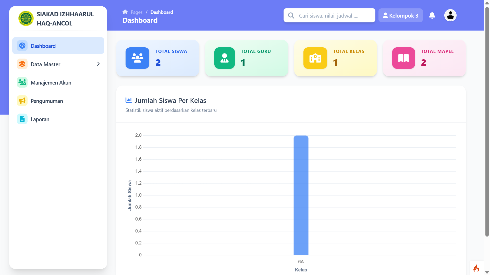
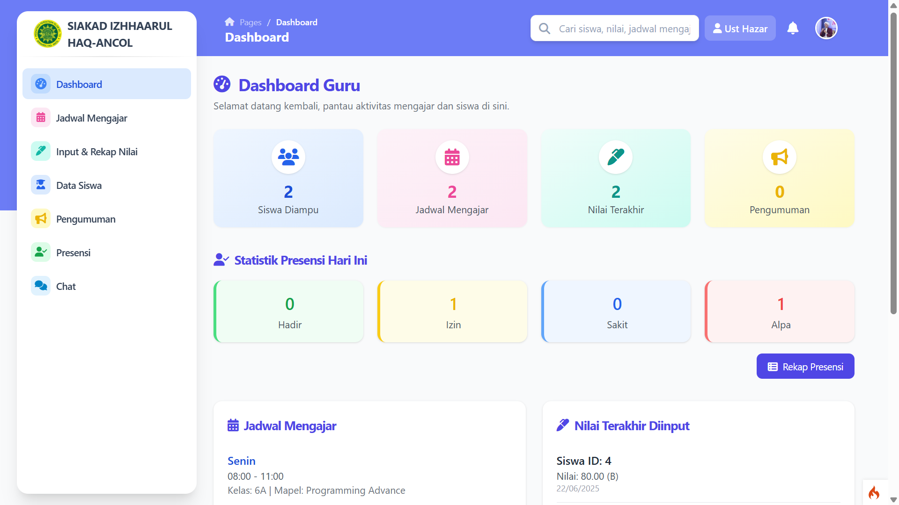
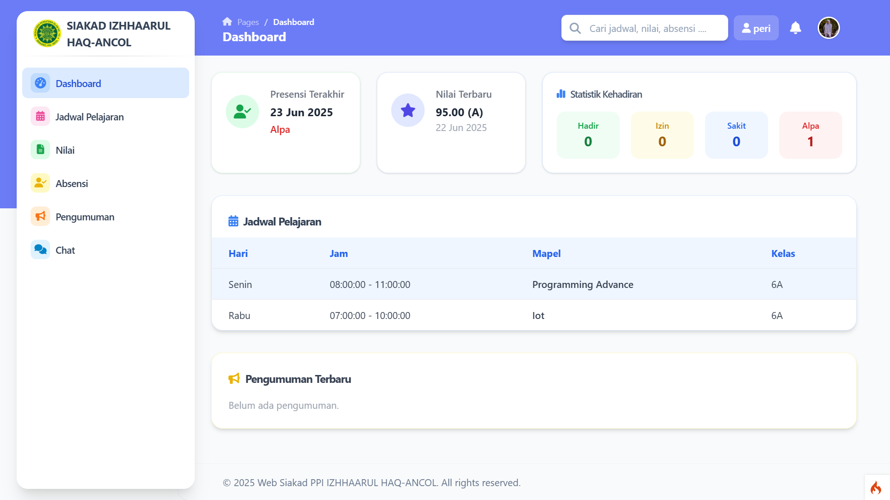

# 🕌 SIAKAD PPI Izhhaarul Haq–Ancol

Sistem Informasi Akademik (SIAKAD) adalah aplikasi berbasis web yang dikembangkan menggunakan **CodeIgniter 4**. Aplikasi ini dirancang khusus untuk mendukung kegiatan administrasi akademik di lingkungan **Pesantren PPI Izhhaarul Haq–Ancol**, mulai dari pengelolaan data santri, guru, absensi, nilai, jadwal pelajaran, hingga komunikasi realtime antar pengguna.

---

## 🖼️ Tampilan
1. **Tampilan Login:**
> 

2. **Tampilan Dashboard Admin:**
> 

3. **Tampilan Dashboard Guru:**
> 

4. **Tampilan Dashboard Siswa:**
> 

---

## ⚙️ Instalasi

1. **Clone repository:**

    ```bash
    git clone https://github.com/RizkiMs100404/Siakad.git
    cd Siakad
    ```

2. **Install dependency dengan Composer:**

    ```bash
    composer install
    ```

3. **Salin dan atur file `.env`:**

    ```bash
    cp .env.example .env
    ```

    Edit koneksi database di `.env`:

    ```env
    database.default.hostname = localhost
    database.default.database = siakad
    database.default.username = root
    database.default.password =
    ```

4. **Buat database dan jalankan migrasi:**

    ```bash
    php spark migrate
    ```

5. **Jalankan server lokal:**

    ```bash
    php spark serve
    ```

    Akses melalui browser: [http://localhost:8080](http://localhost:8080)

---

## 👥 KELOMPOK 3 — Kontributor

- **Rizki Mustofa**
- **Rina Rahmawijaya**
- **Nurul Kiftiyah**
- **Fikri**
- **Faizal**

---

## 📄 Lisensi

Proyek ini bersifat open-source dan bebas digunakan untuk keperluan pengembangan sistem akademik lainnya di lingkungan pendidikan pesantren dan sekolah.

